# Controls

You can switch between QWERTY and AZERTY controls in the settings panel.

## QWERTY

|Key    |Action    |
|-------|----------|
|W      | Forwards |
|S      | Back     |
|A      | Left     |
|D      | Right    |
|Q      | Down     |
|E      | Up       |
|Shift  | Increase camera speed |
|Control + Z | Undo |
|Control + Y | Redo |
|Space  | Hide UI  |
|P      | Take a screenshot (note it doesn't hide the UI) |
|mousewheel | adjust brush radius |
|Shift + mousewheel | adjust brush strength |
| Control + mousewheel | rotate brush |
|left mouse  | interact |
|right mouse | rotate camera |

## AZERTY

|Key    |Action    |
|-------|----------|
|Z      | Forwards |
|S      | Back     |
|Q      | Left     |
|D      | Right    |
|A      | Down     |
|E      | Up       |
|Shift  | Increase camera speed |
|Control + W | Undo |
|Control + Y | Redo |
|Space  | Hide UI  |
|P      | Take a screenshot (note it doesn't hide the UI) |
|mousewheel | adjust brush radius |
|Shift + mousewheel | adjust brush strength |
| Control + mousewheel | rotate brush |
|left mouse  | interact |
|right mouse | rotate camera |

# Camera selection

There are 4 cameras which can be selected using the four numbered buttons at the top right of the screen.

\newpage

# System tab

## New
Controls for creating a new terrain

- **Flat** will create a flat terrain at the middle height
- **Heightmap** load either a raw or png heightmap file
- **procedural** procedurally generate a terrain. See [Procedural Generation](#procedural-generation)

## Load/Save
Loading and saving old terrain files

## Export
Export the terrain. Note this will only export the terrain and won't export any light, cloud or water settings.

- **Object** export the terrain as a wavefront obj file. This will create 3 files. *filename*.obj *filename*.mtl and *filename*.png
- **Scale** Increase the size of the exported mesh
- **Heightmap** Exports a raw heightmap file

## Other

- **Reset** Resets the terrain and any settings to the default
- **Help** Opens up a help window
- **About** Opens up the about window
- **Settings** Opens the settings window

\newpage

# Materials tab

This allows you to mix up to 5 materials based on the material settings

## Settings

- **Tiling** Adjusts the scale of all 5 materials
- **Ambient Occlusion** Will turn on the materials' ambient occlusion texture

## Base material
Select the base material

## Material 2 - 5
Select the materials to mix with the base material. The materials are applied in numerical order. So material 4 will cover material 3

### Material Dropdown
Set how the material will be mixed

- **Top** Applies the material from the top downwards
- **Steep** Applies the material to steep areas
- **Bottom** Applies the material from the bottom upwards
- **Shallow** Applies the material to shallow areas
- **Peaks** Applies the material to peaks (Experimental)
- **Valleys** Applies the material to valleys (Experimental)
- **Random** Applies the material based on a simplified perlin noise

(NB) The peaks and valleys settings are still a work in progress. Choosing them will slow down any sculpt operations and they aren't totally accurate.

### Factor
How much of the material to mix in

### Random seed
Used when using the **Random** option to provide an offset for the perlin noise function

## Material buttons

Click on the material picture in order to bring up the list of available materials.

If the color toggle is selected then this layer will be painted with the selected color instead of a material.

New materials can be imported by clicking on the import button. See [Importing brushes, materials and textures](#importing-brushes-materials-and-textures)

\newpage

# Sculpt tab

Use this mode to sculpt the terrain.

- **Radius** The radius of the sculpting brush (Can be controlled using the mousewheel)
- **Strength** Controls the sculpting strength (Can be controlled with shift and the mousewheel)
- **Rotation** Controls the rotation of the sculpt brush (Can be controledd with control and the mousewheel)

The sculpt controls are
- Left click - Raise the terrain
- Shift + Left click - Lower the terrain
- Control + Left Click - flatten the terrain

## Brush buttons

Click on the brush picture in order to bring up the list of available brushes.

New brushes can be imported by clicking on the import button. See [Importing brushes, materials and textures](#importing-brushes-materials-and-textures)

\newpage

# Stamp tab
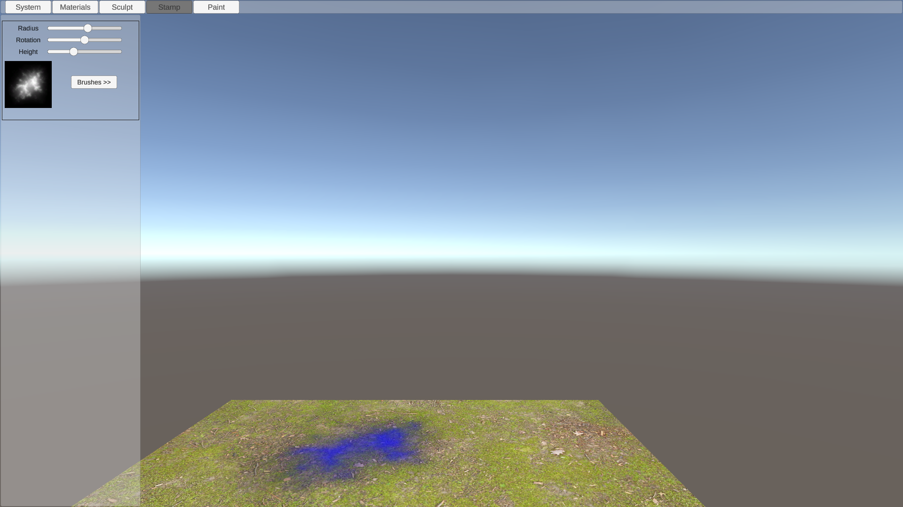

- **Radius** The radius of the paint brush (Can be controlled using the mousewheel)
- **Strength** Controls the painting strength (Can be controlled with shift and the mousewheel)
- **Rotation** Controls the rotation of the paint brush (Can be controledd with control and the mousewheel)

The stamp controls are

- **Left click** Raise terrain
- **Shift + Left click** Lower terrain

## Brush buttons

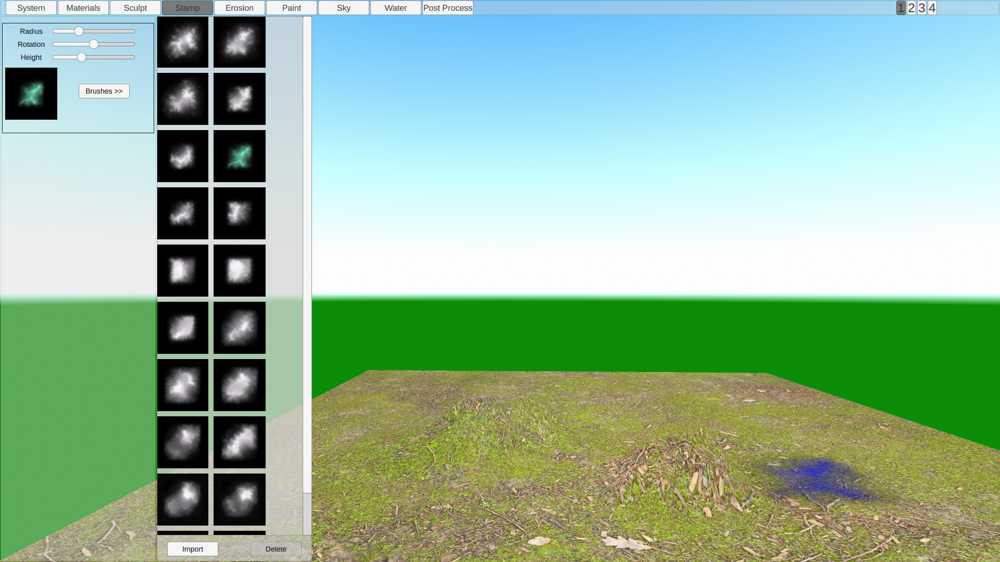

Click on the brush picture in order to bring up the list of available brushes.

New brushes can be imported by clicking on the import button. See [Importing brushes, materials and textures](#importing-brushes-materials-and-textures)

\newpage

# Erosion Tab

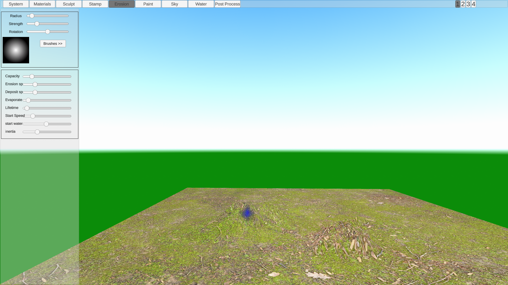

Erodes the terrain under the brush.

- **Radius** The radius of the paint brush (Can be controlled using the mousewheel)
- **Strength** Controls the painting strength (Can be controlled with shift and the mousewheel)
- **Rotation** Controls the rotation of the paint brush (Can be controledd with control and the mousewheel)

The erosion control is left click to erode the terrain.

## Erosion settings

- Capacity - how much sediment the water can hold
- Erosion sp - How fast terrain is eroded
- Deposit sp - How fast terrain is deposited
- Evaporation - How fast water evaporates
- Lifetime - How many cycles each particle should last for
- start speed - How fast each particle is moving (speed affects the amount of sediment water can hold)
- Start water - The amount of water each particle contains at the start
- Inertia - How closely does the water particle follow the terrain (lower inertia will follow the terrain more closely while higer inertia will try to maintain a constant velocity)

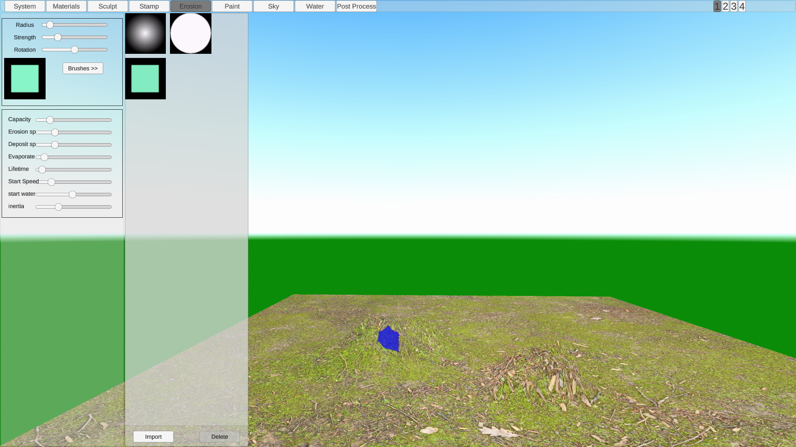

Click on the brush picture in order to bring up the list of available brushes.

New brushes can be imported by clicking on the import button. See [Importing brushes, materials and textures](#importing-brushes-materials-and-textures)

\newpage

# Paint Tab
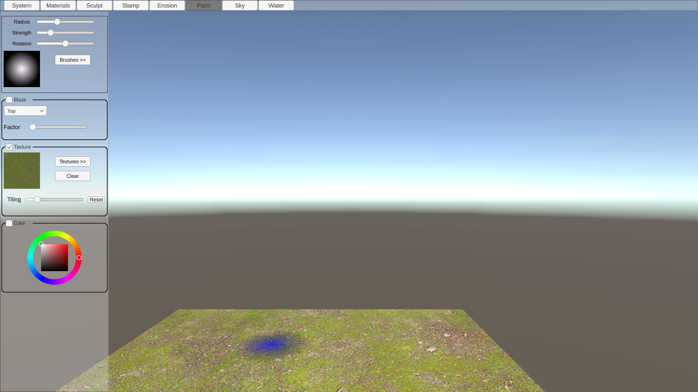

Paint textures or colors over the terrain

- **Radius** The radius of the paint brush (Can be controlled using the mousewheel)
- **Strength** Controls the painting strength (Can be controlled with shift and the mousewheel)
- **Rotation** Controls the rotation of the paint brush (Can be controledd with control and the mousewheel)

- **Texture** Paint the selected texture
- **Textures** Choose the texture to paint
- **Clear** Clears any painted textures
- **Tiling** Will scale the texture to be painted
- **Reset** Resets the tiling value to 1
- **Color** Paint the selected color
- **Color Picker** Choose which color to paint

The paint controls are

- Left click - Paint
- Shift + Left click - Erase

## Brush buttons

Click on the brush picture in order to bring up the list of available brushes.

New brushes can be imported by clicking on the import button. See [Importing brushes, materials and textures](#importing-brushes-materials-and-textures)

## Texture buttons

Click on the texture picture in order to bring up the list of available textures.

New textures can be imported by clicking on the import button. See [Importing brushes, materials and textures](#importing-brushes-materials-and-textures)

## Mask

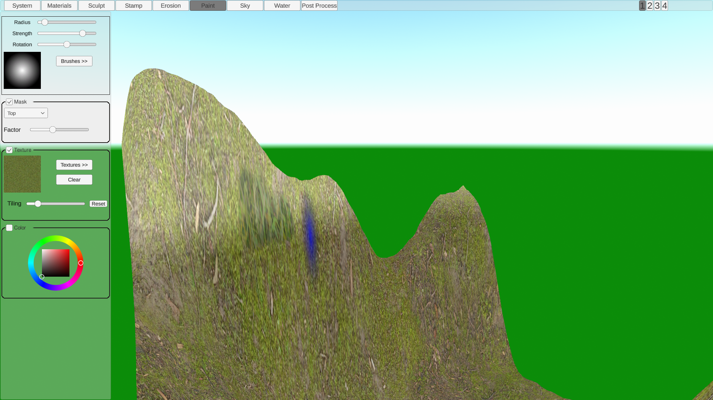

It's possible to place a mask so that only certain areas will be painted to. This mask can be set by either the height or steepness of the map. When masking is turned on the paintable areas will appear slightly brighter and the blocked areas slightly darker.

\newpage

# Sky Tab

## Lighting

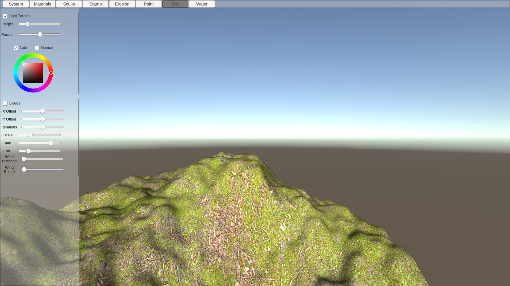

- **Light terrain** Should the terrain be lit up
- **Height** The height of the sun
- **Position** The horizontal position of the sun
- **Auto** Automatically set the color of the sun based on its height
- **Color Picker** Used to control the color of the sun when in manual mode

## Skybox
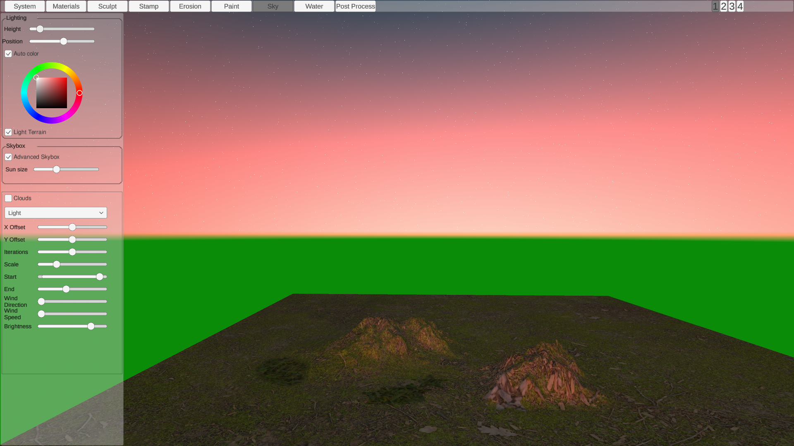

This allows you to turn on a procedurally generated skybox which will change depending on the height of the sun.

- **Advanced Skybox** Turns on a procedurally generated skybox
- **Sun size** controls the size of the sun disk

## Clouds

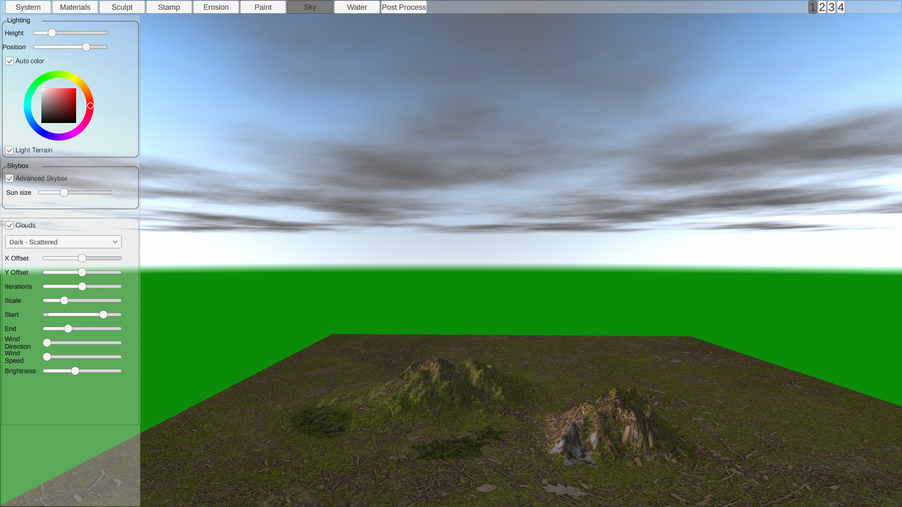

Adds a layer of clouds using simple perlin noise. The color of the clouds is affected by the sun color.

- **Clouds** Turn on the cloud layer
- **X offset, Y offset** Applies and offset to the noise function
- **Iterations** The number of times to run the noise function
- **Scale** The scale of the noise function
- **Start, End** Control the density of the clouds
- **Wind direction** The direction the clouds should move in degrees. 0 Will move them 
- **Wind Speed** The speed of clouds movement

## Skybox
- **Advanced Skybox** - switches to a procedural skybox which changes color depending on the height of the sun

\newpage

# Water Tab

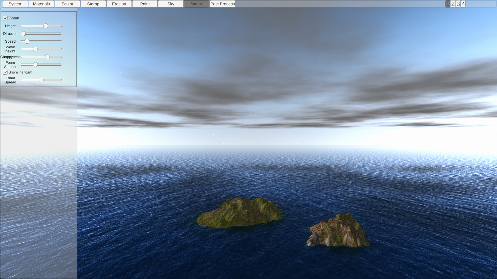

- **Ocean** Turns on the ocean
- **Height** Controls the height of the ocean
- **Direction** The direction the waves move in degrees
- **Speed** The speed of the waves
- **Wave height** The height of the waves
- **Choppiness** How choppy the waves are
- **Foam amount** How much foam to place
- **Shoreline foam** Places foam where the terrain intersects with the ocean
- **Foam Spread** How far the foam should spread out from the shoreline

\newpage

# Post Processing Tab

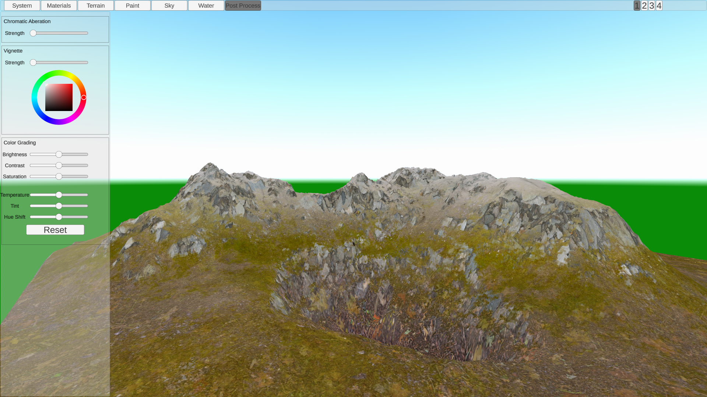

## Chromatic Aberation
Splits up colors as if being viewed through a lens

## Vignette

Darkens the corners of the scene. The of the corners can be set using the color selector.

## Color Grading
Allows you to control the exposure and coloring of the scene

- **Brightness** Control the scene's brightness
- **Contrast** Control the contrast between bright and dark areas
- **Saturation** Controls color saturation
- **Temperature** Controls the white balance of the scene
- **Tint** Applies a colored tint to the scene
- **Hue shift** Shifts the colors of the scene
- **Reset** Resets all the color grading settings

\newpage

# Procedural Generation

## Base

### Perlin

Controls the settings for the perlin noise.

- Xoffset & Yoffset: the position within the noise.
- Scale: the size of the noise
- Iterations: how many layers of perlin noise to add.
- Factor: How much to change the affect of each successive iteraion

### Voronoi

Controls the settings for the voronoi noise

- Xoffset & Yoffset: the position within the noise.
- Cell Size: the size of the voronoi cells
- Valleys: Creates valleys between each section of voronoi noise

### Factor
The amount of Perlin vs Voronoi noise to use

### Settings

- Min height: Set a minimum height
- Height factor: Multiply all heights by this amount
- Clamp Edges: Ensures the heights tend towards the midpoint as they get closer to the edge

\newpage

## Features

### Mountains
- Type dropdown: The type of noise to use to create the mountains
- X offset: X offset for the noise
- Y offset: Y offset for the noise
- Scale: The scale of the noise
- Height: Height factor applied to the noise
- Iterations: Number of iterations of noise to apply
- Factor: Multiplier to apply to each iteration of noise
- Rotation: How much to rotate each iteration of noise
- Voronoi type: Method for calculating the voronoi noise

### Plateaus
Adds flattened areas to the heightmap. Which areas to flatten is determined using voronoi noise while the height to flatten to is determined using perlin noise.

- X offset, Y offset: Offsets for the noise
- Scale: Scale factor for the noise
- Amplitude: Factor applied to the perlin noise funtion when calculating plateau height
- Voronoi type: Method for calculating the voronoi noise

\newpage

## Modifiers

### Terraces

Add a terrace effect to the terrain. You can add up to three layers of terraces.

- Count - the number of terraces to have in this layer
- Shape - the shape of the terraces

### Erode

Adds an erosion effect. This implements a particle based hydraulic erosion system.
Note this is a work in progress and currently won't produce good results

- Iterations - The number of particles to simulate
- Capacity - how much sediment the water can hold
- Erosion sp - How fast terrain is eroded
- Deposit sp - How fast terrain is deposited
- Evaporation - How fast water evaporates
- Lifetime - How many cycles each particle should last for
- start speed - How fast each particle is moving (speed affects the amount of sediment water can hold)
- Start water - The amount of water each particle contains at the start
- Inertia - How closely does the water particle follow the terrain (lower inertia will follow the terrain more closely while higer inertia will try to maintain a constant velocity)

## Heightmap

A top down view of the heightmap

## Buttons

- Cancel: Cancel the procedutal generation and return the terrain to it's previous form
- Apply: permanently apply the procedurally generated terrain. This cannot be undone.

\newpage

# Importing brushes, materials and textures

Click on the import button and then select the image file to import.

## Brushes
Brushes should be square, greyscale images. Black areas are transparent, white areas are completely opaque.
Note any stamps which work with Unity's terrain system can be imported.

## Materials and textures
These should be square jpg or png images. Images with a resolution of around 2kx2k work best. Importing large materials can slow down paint operations.

\newpage

