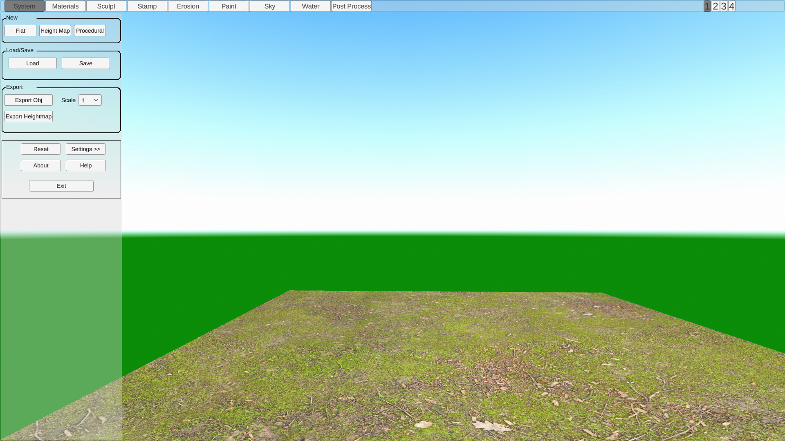
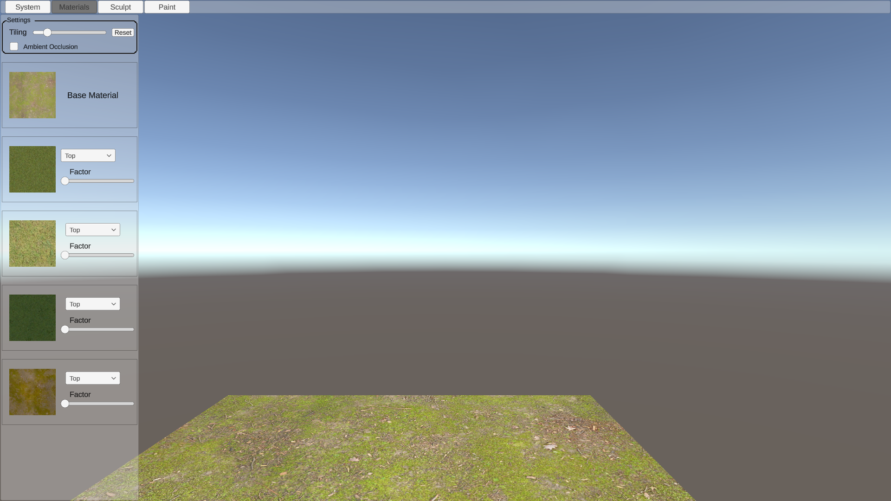
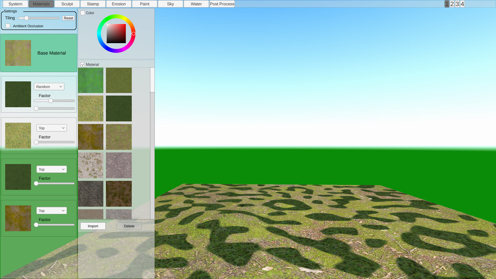
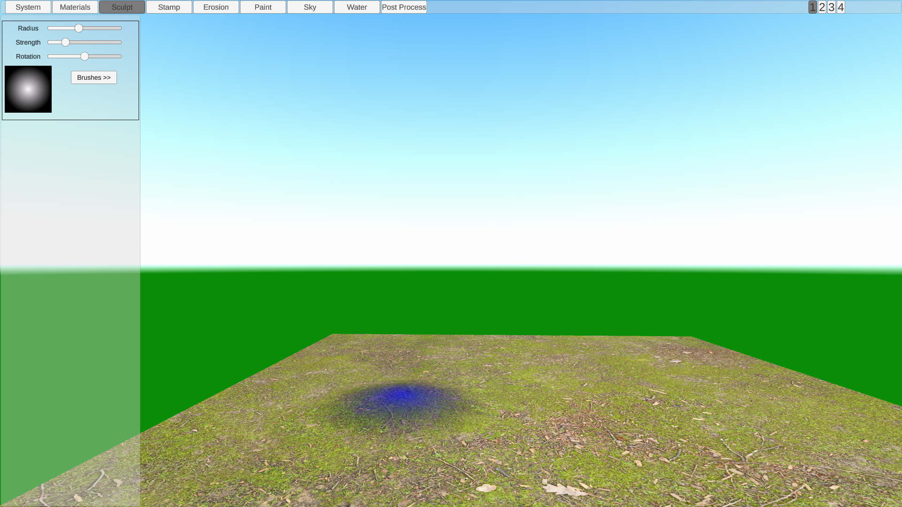
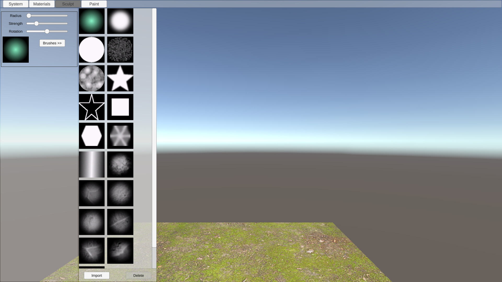
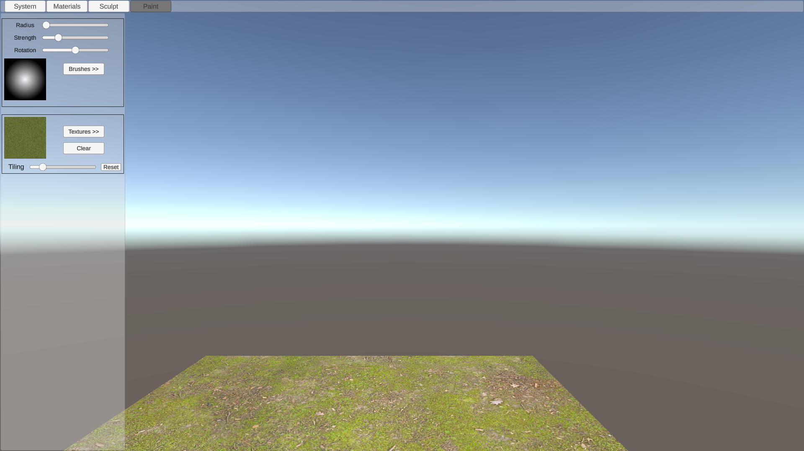
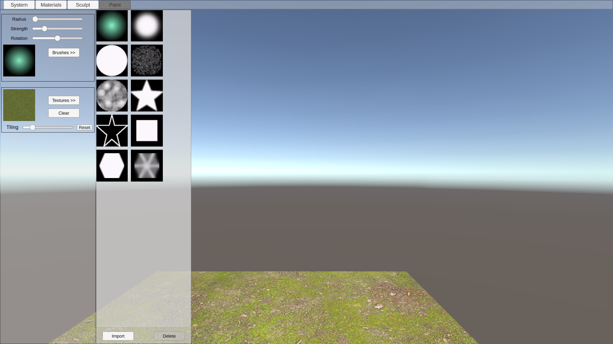
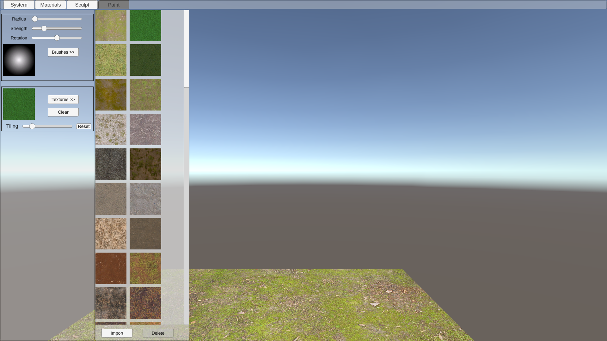
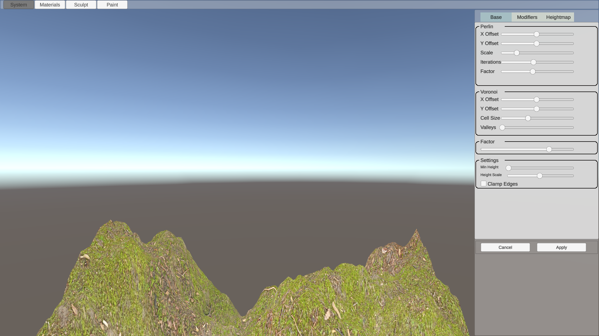
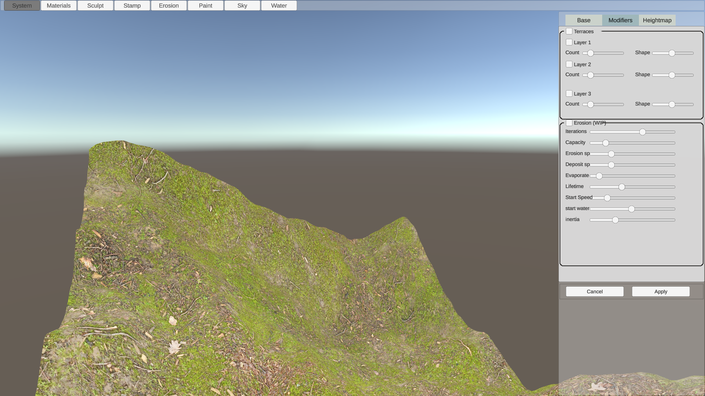

# Controls
|Key    |Action    |
|-------|----------|
|W      | Forwards |
|S      | Back     |
|A      | Left     |
|D      | Right    |
|Q      | Down     |
|E      | Up       |
|Shift  | Increase camera speed |
|Control + Z | Undo |
|Control + Y | Redo |
|Space  | Hide UI  |
|P      | Take a screenshot (note it doesn't hide the UI) |
|mousewheel | adjust brush radius |
|Shift + mousewheel | adjust brush strength |
| Control + mousewheel | rotate brush |
|left mouse  | interact |
|right mouse | rotate camera |

\newpage

# System tab

## New
Controls for creating a new terrain

- **Flat** will create a flat terrain at the middle height
- **Heightmap** load either a raw or png heightmap file
- **procedural** procedurally generate a terrain. See [Procedural Generation](#procedural-generation)

## Load/Save
Loading and saving old terrain files

## Export
Export the terrain

- **Object** export the terrain as a wavefront obj file. This will create 3 files. *filename*.obj *filename*.mtl and *filename*.png
- **Scale** Increase the size of the exported mesh
- **Heightmap** Exports a raw heightmap file

## Other

- **Reset** Resets the terrain and any settings to the default
- **Help** Opens up a help window
- **About** Opens up the about window
- **Settings** Opens the settings window

\newpage

# Materials tab

This allows you to mix up to 5 materials based on the material settings

## Settings

- **Tiling** Adjusts the scale of all 5 materials
- **Ambient Occlusion** Will turn on the materials' ambient occlusion texture

## Base material
Select the base material

## Material 2 - 5
Select the materials to mix with the base material. The materials are applied in numerical order. So material 4 will cover material 3

### Material Dropdown
Set how the material will be mixed

- **Top** Applies the material from the top downwards
- **Steep** Applies the material to steep areas
- **Bottom** Applies the material from the bottom upwards
- **Shallow** Applies the material to shallow areas
- **Peaks** Applies the material to peaks (Experimental)
- **Valleys** Applies the material to valleys (Experimental)
- **Random** Applies the material based on a simplified perlin noise

(NB) The peaks and valleys settings are still a work in progress. Choosing them will slow down any sculpt operations and they aren't totally accurate.

### Factor
How much of the material to mix in

### Random seed
Used when using the **Random** option to provide an offset for the perlin noise function

## Material buttons

Click on the material picture in order to bring up the list of available materials.

New materials can be imported by clicking on the import button. See [Importing brushes, materials and textures](#importing-brushes-materials-and-textures)

\newpage

# Sculpt tab

Use this mode to sculpt the terrain.

- **Radius** The radius of the sculpting brush (Can be controlled using the mousewheel)
- **Strength** Controls the sculpting strength (Can be controlled with shift and the mousewheel)
- **Rotation** Controls the rotation of the sculpt brush (Can be controledd with control and the mousewheel)

The sculpt controls are
- Left click - Raise the terrain
- Shift + Left click - Lower the terrain
- Control + Left Click - flatten the terrain

## Brush buttons

Click on the brush picture in order to bring up the list of available brushes.

New brushes can be imported by clicking on the import button. See [Importing brushes, materials and textures](#importing-brushes-materials-and-textures)

\newpage

# Paint Tab

Paint textures over the terrain

- **Radius** The radius of the paint brush (Can be controlled using the mousewheel)
- **Strength** Controls the painting strength (Can be controlled with shift and the mousewheel)
- **Rotation** Controls the rotation of the paint brush (Can be controledd with control and the mousewheel)

- **Textures** Choose the texture to paint
- **Clear** Clears any painted textures
- **Tiling** Will scale the texture to be painted
- **Reset** Resets the tiling value to 1

The paint controls are

- Left click - Paint
- Shift + Left click - Erase

## Brush buttons

Click on the brush picture in order to bring up the list of available brushes.

New brushes can be imported by clicking on the import button. See [Importing brushes, materials and textures](#importing-brushes-materials-and-textures)

## Texture buttons

Click on the texture picture in order to bring up the list of available textures.

New textures can be imported by clicking on the import button. See [Importing brushes, materials and textures](#importing-brushes-materials-and-textures)

\newpage

# Procedural Generation

## Base

### Perlin

Controls the settings for the perlin noise.

- Xoffset & Yoffset: the position within the noise.
- Scale: the size of the noise
- Iterations: how many layers of perlin noise to add.
- Factor: How much to change the affect of each successive iteraion

### Voronoi

Controls the settings for the voronoi noise

- Xoffset & Yoffset: the position within the noise.
- Cell Size: the size of the voronoi cells
- Valleys: Creates valleys between each section of voronoi noise

### Factor
The amount of Perlin vs Voronoi noise to use

### Settings

- Min height: Set a minimum height
- Height factor: Multiply all heights by this amount
- Clamp Edges: Ensures the heights tend towards the midpoint as they get closer to the edge

\newpage

## Modifiers

### Terraces

Add a terrace effect to the terrain. You can add up to three layers of terraces.

- Count - the number of terraces to have in this layer
- Shape - the shape of the terraces

### Erode

Adds an erosion effect. This implements a particle based hydraulic erosion system.
Note this is a work in progress and currently won't produce good results

- Iterations - The number of particles to simulate
- Capacity - how much sediment the water can hold
- Erosion sp - How fast terrain is eroded
- Deposit sp - How fast terrain is deposited
- Evaporation - How fast water evaporates
- Lifetime - How many cycles each particle should last for
- start speed - How fast each particle is moving (speed affects the amount of sediment water can hold)
- Start water - The amount of water each particle contains at the start
- Inertia - How closely does the water particle follow the terrain (lower inertia will follow the terrain more closely while higer inertia will try to maintain a constant velocity)

## Heightmap

A top down view of the heightmap

## Buttons

- Cancel: Cancel the procedutal generation and return the terrain to it's previous form
- Apply: permanently apply the procedurally generated terrain. This cannot be undone.

\newpage

# Importing brushes, materials and textures

Click on the import button and then select the image file to import.

## Brushes
Brushes should be square, greyscale images. Black areas are transparent, white areas are completely opaque.

## Materials and textures
These should be square jpg or png images. Images with a resolution of around 2kx2k work best. Importing large materials can slow down paint operations.

\newpage

